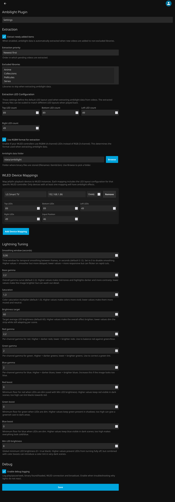

# Jellyfin Ambilight Plugin

**Version:** 1.5.7

Transform your Jellyfin viewing experience with synchronized ambient lighting! This plugin automatically creates immersive ambilight effects for your movies and TV shows by controlling WLED-compatible LED strips.

## What is Ambilight?

Ambilight creates ambient lighting that matches the colors on your screen edges, extending the picture beyond your TV or monitor. This plugin analyzes your video content and sends real-time color data to your WLED LED strips, creating a stunning visual experience.

## Features

- **Automatic extraction** - The plugin scans your Jellyfin library and prepares ambilight data for your videos
- **Seamless playback** - Lights automatically sync when you start watching
- **Multi-device support** - Control different LED setups for different playback devices
- **Customizable** - Adjust colors, brightness, and LED layout to match your setup
- **Background processing** - Extraction happens automatically without interrupting your viewing

## Requirements

- Jellyfin 10.10.x or compatible version
- WLED-compatible LED controller
- LED strips installed around your TV/monitor
- Docker volume (if running Jellyfin in Docker)

## Installation

### Step 1: Install the Plugin

1. Download the latest `Jellyfin.Plugin.Ambilight.dll` from the releases
2. Copy it to your Jellyfin plugins folder:
   - Default: `/config/plugins/Ambilight/`
   - Create the folder if it doesn't exist
3. Restart Jellyfin

**Important:** Only copy the `.dll` file - no other files are needed.

### Step 2: Configure Docker Volume (Docker Users Only)

If you're running Jellyfin in Docker, you need to add a volume for ambilight data storage.

Add this line to your `docker-compose.yml` under `volumes:`:

```yaml
volumes:
  - /path/on/your/host/ambilight-data:/config/data/ambilight
```

Or if using `docker run`:

```bash
-v /path/on/your/host/ambilight-data:/config/data/ambilight
```

**Example:**
```yaml
services:
  jellyfin:
    image: jellyfin/jellyfin
    volumes:
      - /mnt/media:/media
      - /mnt/jellyfin/config:/config
      - /mnt/jellyfin/ambilight:/config/data/ambilight  # Add this line
```

This folder will store the extracted ambilight data files (`.bin` files) for your videos.

## Configuration

### Accessing Plugin Settings

1. Go to **Jellyfin Dashboard** → **Plugins**
2. Find **Ambilight** in the list
3. Click **Settings** to configure the plugin
4. Click **Manager** to view extraction status and manually extract videos



> **Note:** The screenshot above shows the Settings page. The Manager page provides a list of all videos with their extraction status and manual extraction controls.

### Configuration Options

The plugin settings page is organized into the following sections:

#### Extraction

Controls how and when the plugin processes videos:

- **Extract newly added items** - Automatically extract ambilight data when new videos are added to your libraries
- **Extraction priority** - Order in which videos are processed (newest first, oldest first, alphabetical, or movies newest first)
- **Excluded libraries** - Select which Jellyfin libraries to skip during extraction
- **Hardware acceleration** - Choose hardware-accelerated video decoding for faster extraction. 'Auto' (recommended) uses CPU decoding - most compatible. Select specific hardware (VAAPI, Intel Quick Sync, NVIDIA CUDA, VideoToolbox) only if your system supports it

**Extraction LED Configuration:**

- **Top/Bottom/Left/Right LED counts** - Default LED strip layout used when creating binary files (default: 89/89/49/49)
- **Use RGBW format for extraction** - Enable if your WLED controllers use RGBW (4-channel) LEDs instead of RGB (3-channel)
- **Ambilight data folder** - Where to store extracted `.bin` files (default: `/data/ambilight`)

The extracted data can be automatically scaled to match different LED layouts during playback (configured per device mapping below).

#### WLED Device Mappings

Configure which Jellyfin devices should trigger ambilight effects and where to send them. **Only devices with at least one mapping will have ambilight enabled.**

**How to configure:**
1. Click **"Add Device Mapping"** to create a new mapping
2. **Select device** - Choose from your registered Jellyfin devices (e.g., "Living Room TV")
3. **Enter WLED host** - IP address of your WLED controller (e.g., `192.168.1.100`)
4. **Set port** - Default: `19446` (WLED's standard UDP port)
5. **Configure LED layout** for this specific WLED instance:
   - **Top/Bottom/Left/Right LED counts** - Number of LEDs on each edge of your screen
   - **Input Position** - Starting position in your LED strip (first LED index, typically 0)
6. **Save** - Click the Save button at the bottom
7. **Repeat** - Add more mappings as needed

**Important:** The plugin automatically handles device ID variations (e.g., session timestamps) so your mappings will work across multiple playback sessions from the same device.

**Key features:**
- **Per-device control** - Each playback device routes to its specific WLED instance(s)
- **Per-mapping LED configuration** - Each WLED instance can have its own LED layout for different screen sizes
- **Multi-zone support** - Map the same device to multiple WLED instances for synchronized effects
- **Auto-validation** - Duplicate mappings are automatically detected and prevented
- **Note:** Color order (RGB/GRB/etc.) is configured in WLED's web interface, not in this plugin

#### Lightning Tuning

Fine-tune the appearance and behavior of your ambilight effects:

- **Smoothing window** - Time window for temporal smoothing between frames in seconds (default: 0.12). Set to 0 to disable. Higher values = smoother but more delayed; lower values = more responsive but can flicker on rapid cuts
- **Base gamma** - Overall gamma curve (default: 2.2). Higher values make mid-tones and highlights darker
- **Saturation** - Color saturation multiplier (default: 1.0). Higher = more vivid colors
- **Brightness target** - Target average LED brightness (default: 60)
- **Red/Green/Blue gamma** - Per-channel gamma correction to balance colors
- **Red/Green/Blue boost** - Minimum floor for each color when LEDs are dim
- **Min LED brightness** - Global minimum LED brightness (0 = true black)

#### Debug

- **Enable debug logging** - Logs play/pause/seek, binary found/loaded, WLED connection and broadcast. Enable when troubleshooting why lights don't react

## Using the Plugin

### Extraction Manager

The plugin includes a built-in extraction manager that handles video processing:

#### Automatic Mode (Recommended)

1. Once configured, the plugin automatically scans your library
2. New videos are queued for extraction
3. Processing happens in the background
4. You'll see ambilight data files (`.bin`) created in your data directory

#### What Gets Extracted?

The plugin looks for:
- Movies
- TV show episodes
- Videos matching your time window settings
- Items without existing ambilight data

#### Monitoring Extraction

- Check the Jellyfin logs to see extraction progress
- Each video gets a `.bin` file with the same name in your ambilight data folder
- Extraction time depends on video length and your CPU priority setting

### Watching with Ambilight

1. Start playing any video that's been extracted
2. The plugin automatically detects playback and activates your LEDs
3. Colors sync in real-time with the video
4. Lights turn off when you stop or pause

### Manual Extraction

#### Extraction Manager Page
1. Go to **Jellyfin Dashboard** → **Plugins** → **Ambilight**
2. Click on the **Manager** tab
3. View all videos and their extraction status with real-time progress bars
4. Click "Extract" on specific items or "Extract All Pending"

**Note:** The "Extract All Pending" feature processes videos sequentially (one at a time) to avoid overloading your system and ensure efficient resource usage.

## Troubleshooting

### LEDs Don't Turn On

1. Check your WLED device is online and accessible
2. Verify the IP address and port in plugin settings
3. Make sure the video has been extracted (check for `.bin` file)
4. Enable Debug mode and check Jellyfin logs

### Extraction Not Working

1. Verify ffmpeg is installed (required for video processing)
2. Check CPU priority isn't set too low
3. Ensure the data directory has write permissions
4. Look for error messages in Jellyfin logs

### Wrong Colors or Layout

1. Verify your LED counts match your physical setup
2. Check the LED input position setting
3. Configure color order in WLED's web interface if colors are swapped
4. Try adjusting gamma and saturation

### Docker Volume Issues

1. Make sure the volume path exists on your host
2. Check folder permissions (Jellyfin user needs write access)
3. Verify the path matches your plugin settings

## Advanced Configuration

### Multiple WLED Devices & Multi-Zone Setups

The plugin supports unlimited device-to-WLED mappings:

**Setting up multiple rooms:**
1. Add a mapping for each device/room combination
2. Each device routes to its own WLED instance

**Setting up multi-zone ambilight:**
1. Add multiple mappings with the **same device** but **different WLED hosts**
2. The plugin will broadcast to all matching WLED instances simultaneously
3. Perfect for wraparound lighting, ceiling effects, or multi-strip setups

**Example: Theater room with 3 WLED controllers:**
- Map "Theater Room" → `192.168.1.102:19446` (screen LEDs)
- Map "Theater Room" → `192.168.1.103:19446` (wall LEDs)
- Map "Theater Room" → `192.168.1.104:19446` (ceiling LEDs)

When playing on "Theater Room", all 3 WLED instances receive synchronized color data!

### Storage Management

Ambilight `.bin` files are compressed but can add up:

- Average file size: 10-50 MB per hour of video
- A 2-hour movie ≈ 20-100 MB

## Support & Development

### Getting Help

For issues, questions, or feature requests:

- **Check Jellyfin logs** for error messages (Dashboard → Logs)
- **Review this README** and the configuration screenshot
- **Check existing issues** on the GitHub repository

## License

This project is licensed under the GNU General Public License v3.0 - see the [LICENSE](LICENSE) file for details.

### What does this mean?

The GPLv3 license grants you the freedom to:
- Use this software for any purpose
- Study and modify the source code
- Share copies of the software
- Share your modifications

Under the condition that any distributed modifications or derivative works are also licensed under the GPLv3.

For more information about the GPL license, visit: https://www.gnu.org/licenses/gpl-3.0.html

---

**Enjoy your immersive viewing experience! 🎬✨**
